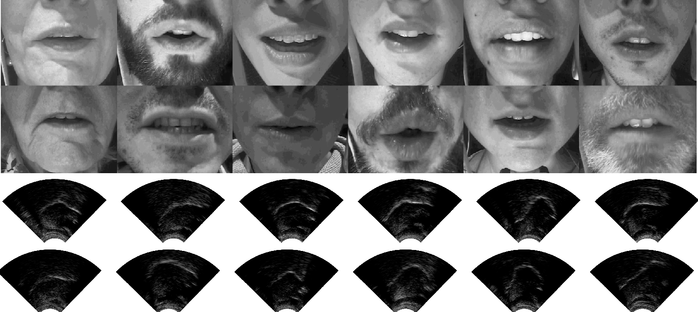

# The Tongue and Lips Corpus

**A multi-speaker corpus of ultrasound images of the tongue and video images of the lips**

The  Tongue  and  Lips  (TaL) corpus is a  multi-speaker  corpus  of  ultrasound  images  of the  tongue  and  video  images  of  lips. This  corpus  contains synchronised  imaging  data  of  extraoral  (lips)  and  intraoral (tongue) articulators from 82 native speakers of English.

For more information, please read the corpus paper (TODO).



### Datasets

The TaL corpus consists of two datasets:

-  **TaL1** is a single-speaker dataset containing data of one professional voice talent, a male native speaker of English, over six recording sessions. 
- **TaL80** is a multi-speaker dataset contains recording sessions of 81 native speakers of English without voice talent experience. Each speaker was recording over a single recording session.


### Speaker and Session Identifiers

In the TaL80 dataset, speaker identifiers denote speaker number, gender (m/f), and country of origin. Country identifiers are: (e)ngland, (s)cotland, (i)reland, (n)orthern-ireland, (o)ther. Examples: *01fi, 02fe, 03mn, 04me, ...*

The TaL1 dataset only has 1 speaker, so there are no speaker identifiers. Instead, we have recording sessions, which are simply called *day1*, *day2*, *day3*, ...

### File Identifiers

For each speaker (TaL80) or session (TaL1), utterances are indexed according to their recording times.
See the prompt text file for recording date/time. Each file ID also includes a tag indicating the prompt type.

| Prompt Tag | Description                                      |
| ---------- | ------------------------------------------------ |
| swa        | swallow                                          |
| cal        | calibration                                      |
| aud        | audible read speech                              |
| sil        | silent speech                                    |
| whi        | whispered speech (TaL1 only)                     |
| spo        | spontaneous speech utterance (unprompted speech) |
| xaud       | shared audible read speech utterances            |
| xsil       | shared silent speech utterances                  |
| xwhi       | shared whispered speech utterance (TaL1 only)    |

</br>

Calibration prompts (**cal**) and swallows (**swa**) were read at the beginning and end of each recording session and before and after a short break.

The tag **x** denotes prompts that were shared across speakers (TaL80) or recording sessions (TaL1).

Examples: 001_swa, 002_cal, 004_xaud, 028_spo, 029_xsil, 038_sil, ...


### Data Types

Each utterance consists of five core data types, which can be identified by their file extension.

**<u>Core data types</u>**

| Data type       | Extension    | Description                                                  |
| --------------- | ------------ | ------------------------------------------------------------ |
| prompt          | .txt         | text file with prompt and datetime of recording              |
| waveform        | .wav         | speech waveform                                              |
| synchronisation | .sync        | audio synchronisation signal (waveform)                      |
| ultrasound      | .ult, .param | raw ultrasound data (.ult) and ultrasound parameters (.param) |
| video           | .mp4         | video images of the lips (synchronised to waveform)          |

</br>

**Example.** The second utterance recorded by speaker 01fi is a calibration utterance with the identifier *002_cal*. The five core data types for this utterance are the files: *002_cal.txt, 002_cal.wav, 002_cal.sync, 002_cal.ult, 002_cal.param, 002_cal.mp3.*

**<u>Additional data</u>**

Because spontaneous speech utterances can be long in duration (up to 60 seconds),  we manually annotated the boundaries of shorter time segments (typically 5-10 seconds). This annotation is available as a CSV file with start and end time in seconds of the short segments nd their respective transcription. This file is identified by the extension *.lab*.


### Structure

TaL1 and TaL80 follow a similar structure, but they are independent datasets. For this reason, shared prompts are only marked within datasets (across speakers for TaL80 and sessions for TaL1). There is an overlap in the recorded prompts in the two datasets. Most prompts read in TaL1 were recorded by the first speakers in TaL80, but a small subset was read by all speakers. Users should be aware of this if using both datasets, particularly when designing training and test splits.

Directory structure for TaL1:

```
/TaL1
	/samples
		/core
		/video
	/core
		/day2
		/day3
		...
	/doc
```

Directory structure for TaL80:

```
/TaL80
	/samples
		/core
		/video
	/core
		/01fi
		/02fe
		/03mn
		...
	/doc
```

The `samples` directory contains a subset of the larger dataset (2 samples per speaker/session). You download this directory first and browse some examples, if you wish to have a quick look at the TaL corpus. In `samples/core`, you will find examples of the core data types. In `samples/video`, you will find the same examples generated with the [tal-tools visualiser](https://github.com/UltraSuite/tal-tools).

The `doc` directory contains the documentation for the data, as well as some additional documents, such as version number and anonymised participant information.

The `core` directory contains the core data for the dataset.


### Download

The datasets are quite large, so please make sure that you have enough disk space before attempting to download.

| Dataset     | Size  |
| ----------- | ----- |
| /TaL1/core  | 49GB  |
| /TaL80/core | 498GB |

</br>

If you prefer to browse some samples before downloading the full data, you can download the `samples` directories.

| Dataset        | Size  |
| -------------- | ----- |
| /TaL1/samples  | 2.1GB |
| /TaL80/samples | 8.2GB |

</br>

To download the TaL corpus, please check the [download instructions for the Ultrasuite repository](../download.md). The instrutions are applicable to the TaL corpus, in case you prefer to download part of the data (an utterance, a specific data type, etc).  Here is a sample command for the TaL1 dataset:

```
TODO: download cmd
```


### Using the data

The video data released with the TaL corpus does not embed the audio. If you wish to see the video with the corresponding waveform, you can use [ffmpeg](https://ffmpeg.org/) with a command such as:

```
ffmpeg -i input.mp4 -i input.wav -c:v copy -map 0:v:0 -map 1:a:0 -c:a ac3 -b:a 192k output.mp4
```

If you wish to visualise the ultrasound, with or without audio, you can use [Ultrasuite tools](https://github.com/UltraSuite/ultrasuite-tools).

For more complex visualisations including video, ultrasound, and spectrogram/waveform, please have a tool at the [TaL corpus visualiser](https://github.com/UltraSuite/tal-tools/tree/master/visualiser).

If you're just interested in general input/output, one or more of [these functions](https://github.com/UltraSuite/tal-tools/blob/master/visualiser/tools/io.py) should provide some useful examples.


### Additional Notes

**TaL1 Notes**

The video synchronisation failed during the first recording session of the TaL1 data. The problem can be seen in the synchronisation signal, which merged the video and ultrasound signals. We opted to release this session, as it might still be useful for some applications that do not depend on video and audio synchronisation. This session is named `day1_no_vid_sync`.

**TaL80 Notes**

Please see the participant notes in `TaL80/doc` for anonymised detailed notes on all participants. We describe here two cases where image quality was not as good as we hoped.

-  Speaker `17ms` has a large amount of facial hair, which hides a large portion of the lips in the video. The ultrasound images of the tongue appear reasonable.
- Speaker `60ms` has a large amount of facial hair under the chin, which created some problems for the ultrasound probe. The video, however, appears reasonable.


### References

If using data or code from the TaL corpus, please provide appropriate web links and cite the following paper:

[1] TODO