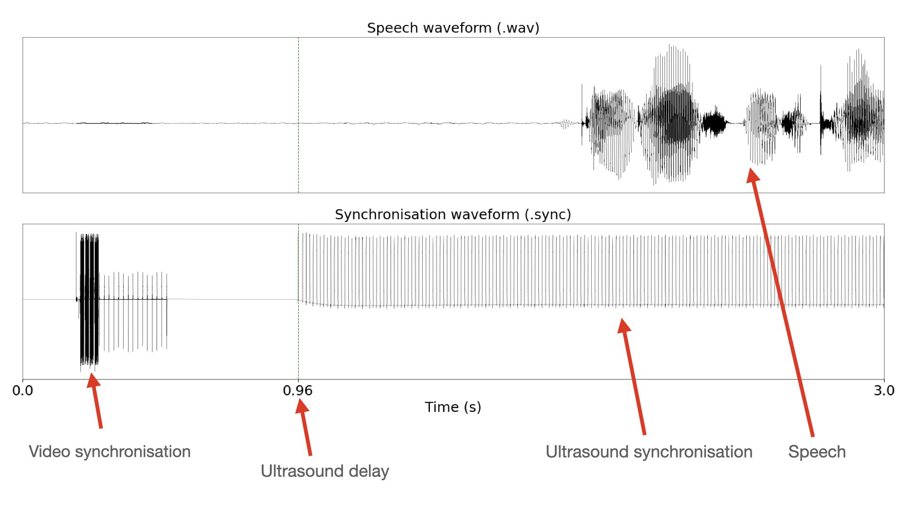
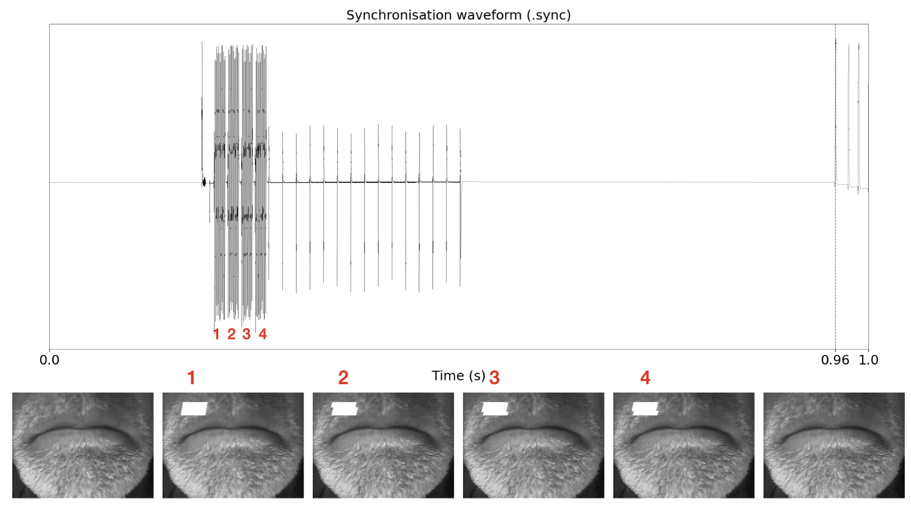
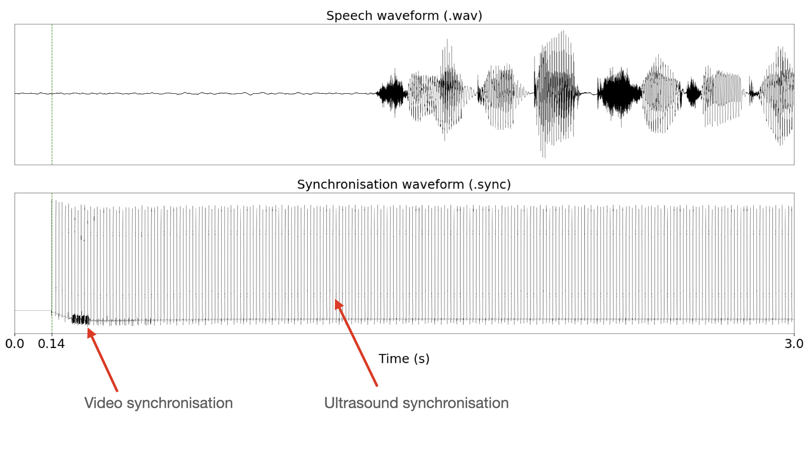

# Synchronisation in the TaL corpus

This page provides some details regarding the synchronisation of the Tongue and Lips corpus. Reading these notes might also help you understand how the data is structured.

We briefly describe how to interpret the synchronisation signal in the TaL corpus. Data was collected using [Articulate Assistant Advanced (AAA)]([AAA](http://www.articulateinstruments.com/aaa)) from [Articulate Instruments](www.articulateinstruments.com). Please contact Articulate Instruments if you have questions related to hardware or other features of AAA.

**Figure 1**: Synchronisation signal components.

Figure 1 visualises the first three seconds of the speech waveform (`.wav`) and the synchronisation signal (`.sync`) from an utterance in the TaL corpus. 

To allow both video and ultrasound synchronisation in AAA, we partitioned the synchronisation channel in time. The first part stored the video sync signal and the second stored the ultrasound sync signal. The time partition is achieved by enforcing a 900 ms time delay on ultrasound data collection. That is, AAA waited 900ms before initiating ultrasound recording.

Therefore, the first 900 ms of the synchronisation signal store the video sync signal. At 900 msecs, ultrasound started collecting data. The ultrasound delay is typically 900 msecs plus a few additional msecs. The remaining msecs are due to additional hardware delays. The exact timestamp for each utterance can be found in the ultrasound metadata  (`.param`) under `TimeInSecsOfFirstFrame`. Each pulse in the ultrasound sync signal is aligned to an ultrasound frame by AAA.

### Video synchronisation

**Figure 2**: The four video synchronisation tones align with four video frames .

Video synchronisation is done with Articulate Instruments proprietary SyncBrightUp unit. This device generates four 2KHz tones and marks four consecutive video frames with a white square on the top-left corner. The generation of the tones and placement of the white marks is done simultaneously. The four tones are followed by a set of pulses that correspond to the vertical sync pulses of the video signal, used to determine the the frame rate.

### The problem with TaL1 - day 1

The first recording session of the TaL corpus (`day1` in the TaL1 dataset) does not include synchronised video data. This session is named `day1_no_vid_sync`. 

**Figure 3:** Synchronisation signal for an utterance in `day1`.

Figure 3 illustrates the problem that occured with `day1`. The ultrasound was not given a delay, so AAA overlapped the ultrasound synchronisation signal and the video synchronisation signal. With the signals embedded, AAA was unable to correctly synchronise the video. Ultrasound synchronisation, however, was successful.

We choose to release `day1` with the TaL corpus as it might still be useful for tasks that do not rely on video data, or tasks that do not require all modalities to be synchronised. Furthermore, this data might be synchronised in the future, either via signal processing or machine learning techniques.

### Parallel data

It should be trivial to find parallel data streams in the TaL corpus. It should be clear from the examples above that ultrasound starts recording with a 900 msec delay. 

The parameter `TimeInSecsOfFirstFrame` found in the ultrasound metadata  (`.param`) denotes the time in seconds of the first ultrasound frame with respect to the waveform. This timestamp can be use to cut the inital msecs of the waveform and the video streams, thus ensuring that all streams start at the same time.

It is also worth noting that the ultrasound stream is typically the last stream to stop recording. To find parallel data, the data streams need to be truncated at the end. This involves finding the duration of the shortest stream and cutting the remaining streams to that duration.

For a practical example, you can look at [this function in TaL tools visualiser](https://github.com/UltraSuite/tal-tools/blob/master/visualiser/tools/utils.py#L57).

### Acknowledgements

Supported by the Carnegie Trust for the Universities of Scotland (Research Incentive Grant number 008585) and the EPSRC Healthcare Partnerships grant number EP/P02338X/1 (Ultrax2020). We thank the participants of this corpus for providing the consent that allows this data to be freely available to the research community.

### References

If using data or code from the TaL corpus, please provide appropriate web links and cite the following paper:

- Ribeiro, M. S., Sanger, J., Zhang, J.-X., Eshky, A., Wrench, A., Richmond, K.,& Renals, S. (2021).  **TaL: a synchronised multi-speaker corpus of ultrasound tongue imaging, audio, and lip videos.** Proceedings of the IEEE Workshop on Spoken Language Technology (SLT). Shenzhen, China. [[paper](../papers/tal_corpus_SLT2021.pdf)] 
- Articulate Instruments Ltd., SyncBrightUp Users Manual: Revision 1.10,  Articulate  Instruments  Ltd.,  Edinburgh,  United Kingdom, 2010.