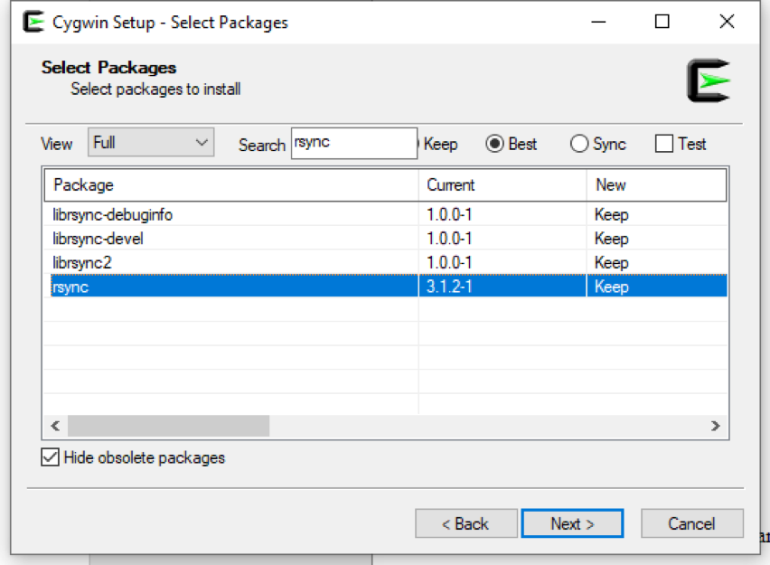
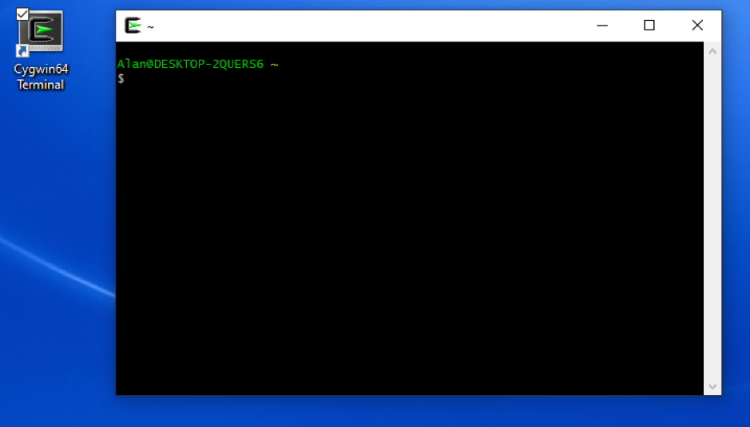

# Download

The complete data from the UltraSuite repository is available via the `rsync` command. This page describes how to install `rsync` for Windows users.

A very small subset of the data from the UltraSuite repository is also available via [Edinburgh DataShare](http://hdl.handle.net/10283/3255). 

### Installing rsync on Windows

1. Go to [https://www.cygwin.com/install.html](https://www.cygwin.com/install.html)
2. Download and run setup-x86_64.exe for Windows 64-bit or setup-x86.exe for Windows 32-bit.
3. Click through all the defaults (pick any mirror site) until the "Select packages" dialogue.
4. Select "Full" and in the search type "rsync". Double click on each "skip" in the "New" column to tell the installer to load these packages.

5. Check “create icon on desktop” and “add icon to start menu” and finish the install.
6. Run Cygwin using icon on desktop or in start menu.

7.  Use `cd` to change directory and `dir` to show the contents of a directory. Change directory to somewhere (perhaps an external hard drive) with enough space to download the Ultrasuite data.
8. Follow the [instructions for downloading ultrasuite](download.md) using rsync.

**Note**: if you encounter problems try running Cygwin by right-clicking and selecting “run as administrator”. 

##### Acknowledgements:

Many thanks to Alan Wrench from [Articulate Instruments](http://www.articulateinstruments.com) for preparing these instructions.

