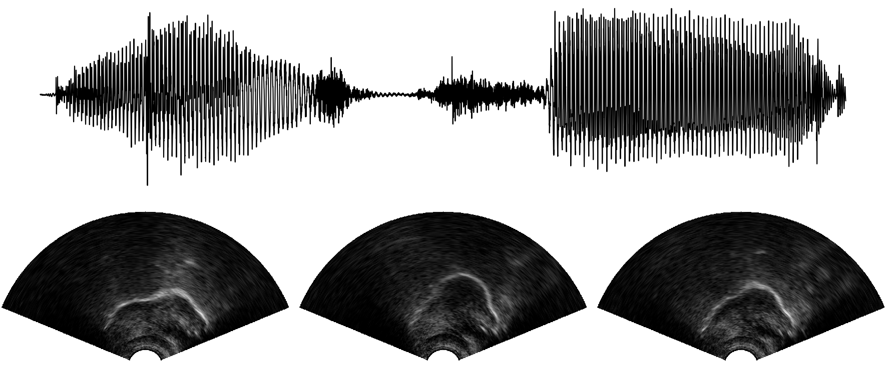

## UltraSuite Repository
**A repository of ultrasound and acoustic data from child speech therapy sessions**

UltraSuite is a repository of ultrasound and acoustic data from child speech therapy sessions. The current release includes three data collections, one from typically developing children and two from children with speech sound disorders. It also includes a set of annotations, some manual and some automatically produced, and tools to process, transform and visualise the data. [Read the paper here!](papers/ultrasuite_IS18.pdf) 

## Data

There are three child speech datasets available in the repository:

- **Ultrax Typically Developing - UXTD.**  A dataset of 58 typically developing children. See [here](data/uxtd.md) for further details.
- **Ultrax Speech Sound Disorders - UXSSD.**  A dataset of 8 children with speech sound disorders. See [here](data/uxssd.md) for further details.
- **UltraPhonix - UPX.** A second dataset of children with speech sound disorders. The data was collected from 20 children.  See [here](data/upx.md) for further details.

And two datasets of adult speech:

- **Tongue and Lips corpus - TaL1**. A single-speaker dataset with data of one professional voice talent, a male native speaker of English, over six recording sessions. Read about the [TaL corpus](data/tal_corpus.md).
- **Tongue and Lips corpus - TaL80.** A multi-speaker dataset with recording sessions of 81 native speakers of English without voice talent experience. Read about the [TaL corpus](data/tal_corpus.md).

## Code

* [Ultrasuite Tools](https://github.com/UltraSuite/ultrasuite-tools) - Python library to process raw ultrasound data.
* [Ultrasuite Kaldi](https://github.com/UltraSuite/ultrasuite-kaldi) - Recipes and other code to use UltraSuite data with the [Kaldi Speech Recognition Toolkit](http://kaldi-asr.org/).

## Contributing

We welcome user contribution to UltraSuite! We are hoping to keep UltraSuite in active development with help from the community. All contributions will be given proper credits! There are various ways to participate: 

**Contributing with data**

The current release of UltraSuite has three datasets of ultrasound and audio from Child speech, but we hope to include additional datasets from other modalities (e.g. MRI) and age groups (e.g. Adults). If you'd like share data that you collected through UltraSuite, please get in touch with any member of the [Ultrax Speech project](http://www.ultrax-speech.org/team). Note that even though data is available through UltraSuite, we encourage users to cite the original authors.

**Contributing with code**

To contribute with [code](https://github.com/UltraSuite/ultrasuite-tools) or to help improve [this documentation](https://github.com/UltraSuite/ultrasuite-doc), please submit your changes with [Pull Requests.](https://help.github.com/articles/about-pull-requests/)

**Reporting issues**

To report any issues, you can use GitHub's Issue Tracker or you can contact any member of the  [Ultrax Speech project](http://www.ultrax-speech.org/team). Please submit any issues related to code in their respective repositories using Github's Issue Tracker. For issues found in the data, please contact us directly.

## Community

Subscribe to the [UltraSuite mailing list](mailing-list.md) to get updates from the UltraSuite repository and to send and receive messages from other UltraSuite users.

## License

Datasets from UltraSuite are distributed under [Attribution-NonCommercial 4.0 Generic (CC BY-NC 4.0).](https://creativecommons.org/licenses/by-nc/4.0/) Code is available under the [Apache License v.2.](https://www.apache.org/licenses/LICENSE-2.0)

## Citation

If using data or code from UltraSuite, please provide appropriate web links and cite the following paper:

* Eshky, A., Ribeiro, M. S., Cleland, J., Richmond, K., Roxburgh, Z.,  Scobbie, J., & Wrench, A. (2018) **Ultrasuite: A repository of ultrasound and acoustic data from child speech therapy sessions**. Proceedings of INTERSPEECH. Hyderabad, India. [[pdf](http://homepages.inf.ed.ac.uk/aeshky/pub/aeshky_IS18.pdf)] [[bibtex](http://homepages.inf.ed.ac.uk/aeshky/pub/aeshky_IS18.bib)]

